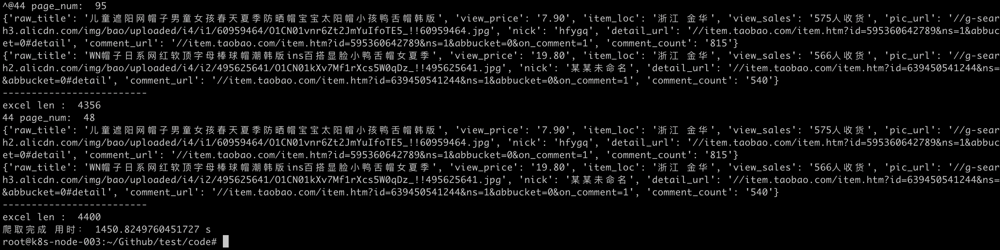
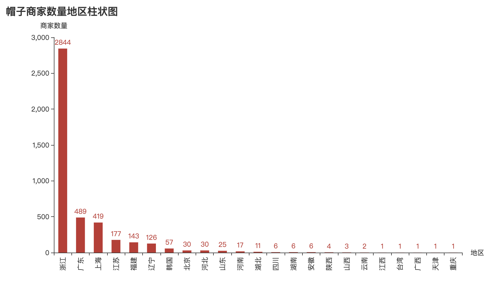
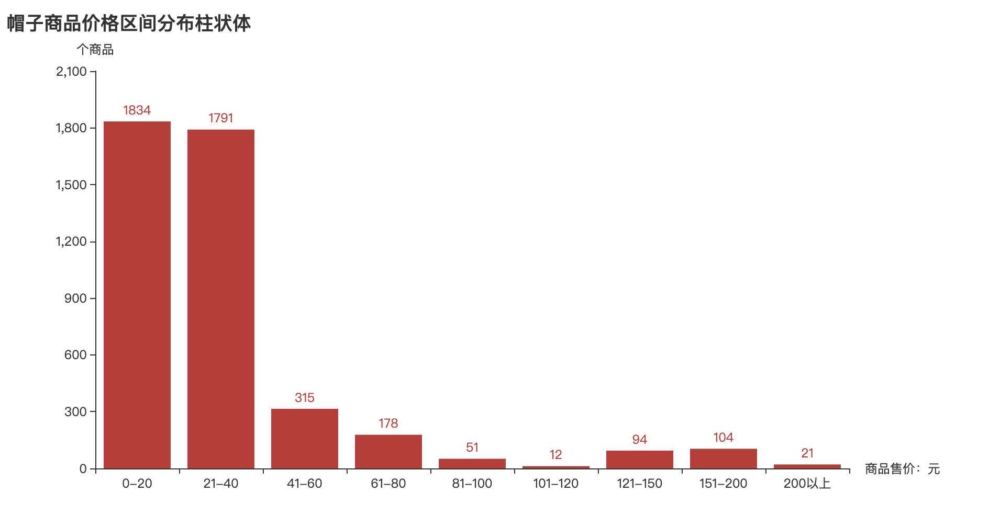
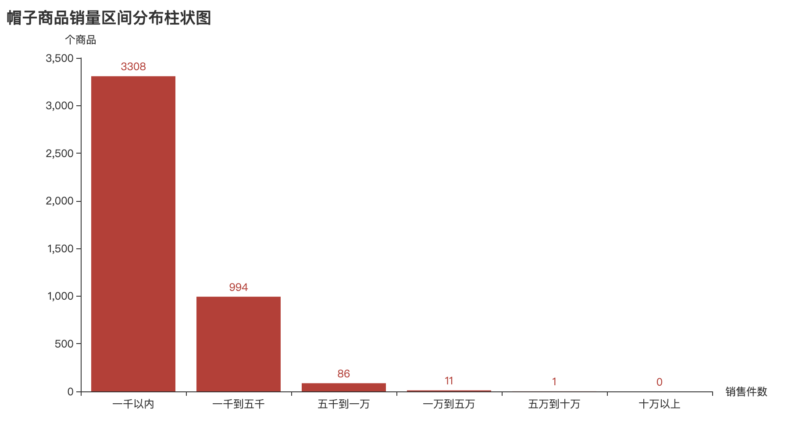
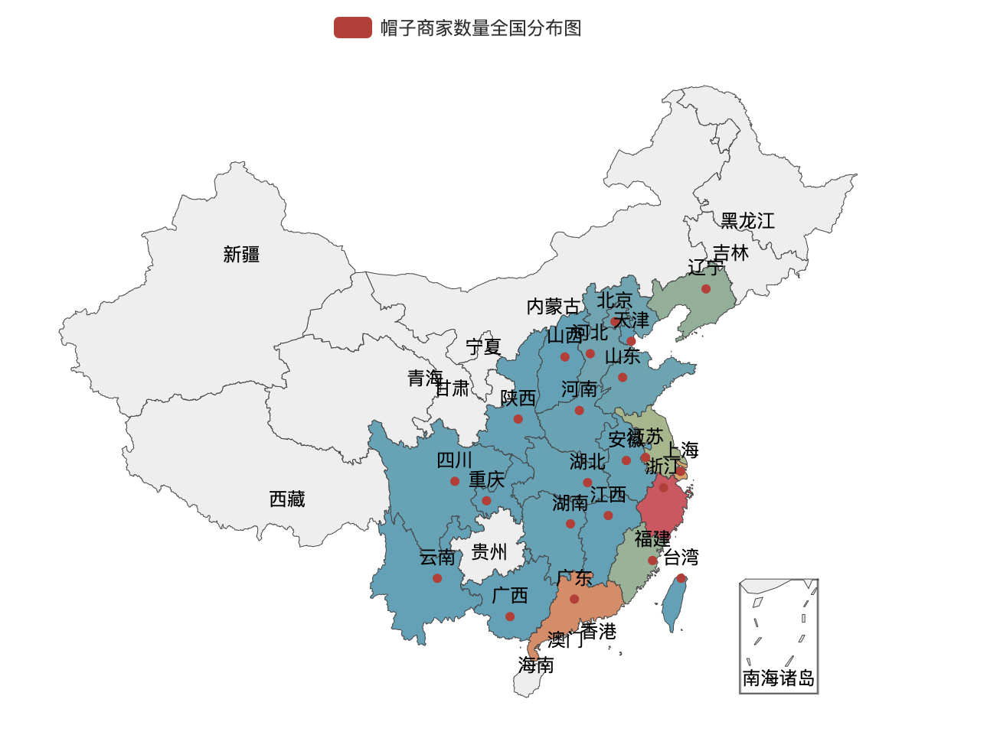
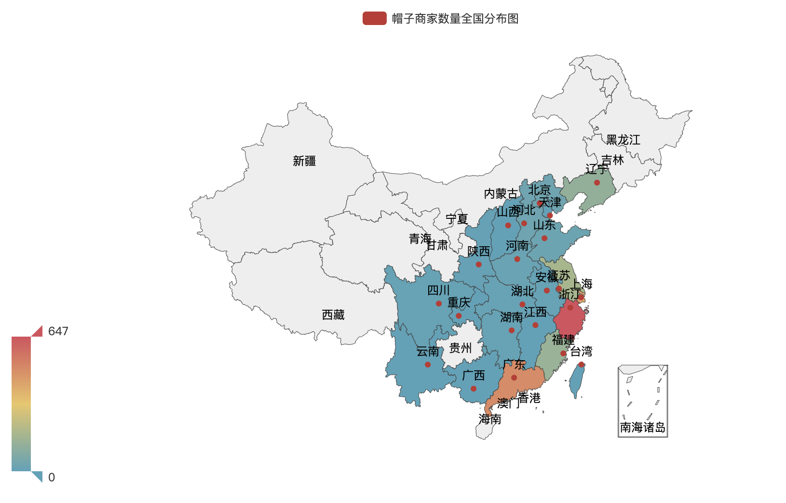
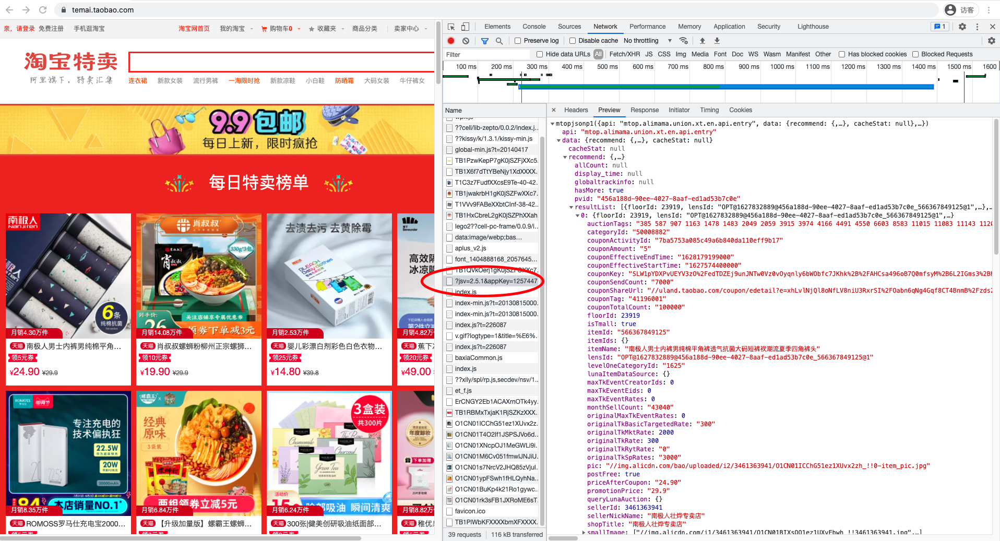
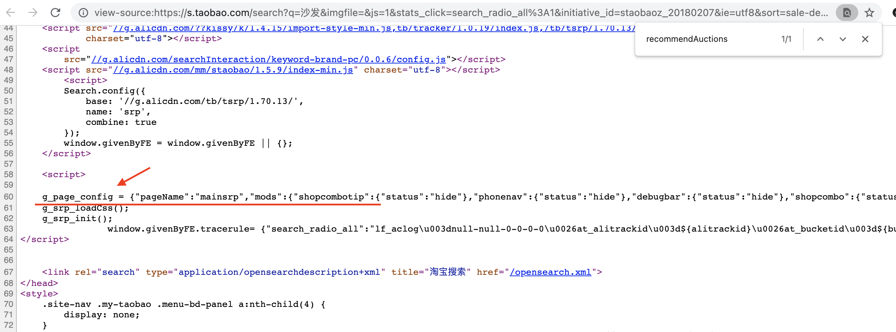

# spider-taobao

## 任务: 爬取淘宝网站销量最高的商品信息
1，使用淘宝搜索，查找相关类目的结果，并按照销售数量排名

2，查找全网（淘宝网）销量最高的商品，这个估计有点麻烦，需要爬取全量商品信息

## 爬取"帽子"商品销售信息

具体见code/spider_taobao.py代码

## 帽子商品数据分析

## 分析淘宝网
重点关注商品url

输入taobao.com网址后，为了数据安全，网站一般使用异步加载的方式获取商品信息，
要想抓取商品销量等信息，需要先借助Chrome等工具，抓取并分析网页后端网络访问流量

### 查找加载数据URL

#### json数据
理想情况下，返回商品的json数据，如，淘宝特卖首页，免登陆，Chrome浏览器分析网页，容易发现异步加载数据接口；访问该URL，即可得到淘宝特卖首推荐的88个商品的json数据；

#### g_page_config数据

淘宝搜索页面，找不到直接返回商品json数据的URL，只能渲染网页后，在DOM html源码中搜索商品信息；处理方式可以参考下面两篇文章；

[利用Python爬虫爬取淘宝商品做数据挖掘分析实战篇，超详细教程](https://zhuanlan.zhihu.com/p/34375874)
[Python爬取淘宝商品信息](https://blog.csdn.net/u014044812/article/details/100563668)

淘宝搜索，输入商品名称后，默认返回100页结果，没页包含44个商品；

code/test001.py代码，使用多线程同时对某个商品类目，发起淘宝搜索请求；由于没有登陆，大部分请求都会失败；不过，还是有机会获取商品信息；

待加入模拟登陆淘宝页面；

## 反爬虫策略，如何避免

### 模拟浏览器登陆

[Python模拟登录淘宝](https://blog.csdn.net/u014044812/article/details/99584382)

### IP地址池

### 多线程，多进程

### 分布式抓取

## pythnon 爬虫框架

分析各个爬虫框架特性，选择一个合适的

- requests：
- scrapy：
- pyppeteer：
- selenium：

# 参考文章
[爬虫必备工具，掌握它就解决了一半的问题](https://zhuanlan.zhihu.com/p/39340856)

[利用Python爬虫爬取淘宝商品做数据挖掘分析实战篇，超详细教程](https://zhuanlan.zhihu.com/p/34375874)

[Python爬取淘宝商品信息](https://blog.csdn.net/u014044812/article/details/100563668)

[Python模拟登录淘宝](https://blog.csdn.net/u014044812/article/details/99584382)

[Pig6](https://github.com/pig6)